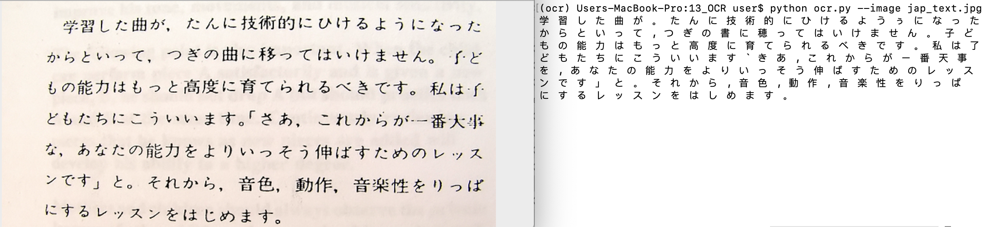

# OCR_Document_Reader
We start off with pip installing the required dependencies:

```
pip install requirements.txt
```

We then run the following code to run the document reader on your desired image file.
```
python ocr.py --image path_to_your_image.jpg
```
**Note:**<br>
The OCR Document Reader will only work with english texts by default.<br>
To read documents that are not in english, please visit below website to download the necessary trained models for the languages you want in your code<br>
https://github.com/tesseract-ocr/tessdata

After that, move the downloaded trained models into the following path <br>
/usr/share/tesseract-ocr/{version_number}/tessdata/

Lastly, you need to change the following line in ocr.py to include the language that you want.<br>
In the below case, my language was set to 'jpn' for japanese.
```
text = pytesseract.image_to_string(Image.open(filename),lang='jpn')
```

Example output:


